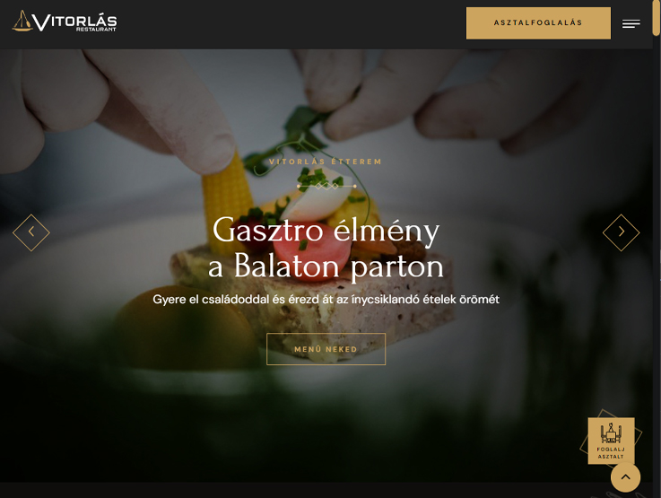
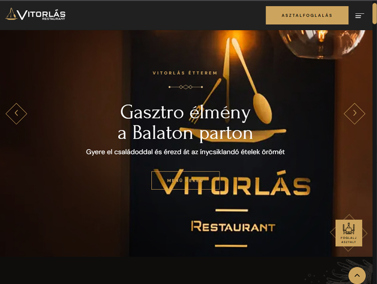

# [Vitorlás Restaurant](https://lebryere.github.io/Vitrolas-etterem/)

## Browser Support

 |  |  |  |  | 
--- | --- | --- | --- | --- | --- |
94+ ✔ | 92+ ✔ | 89+ ✔ | 82+ ✔ | 87+ ✔ | 55+ ✔ |

## Preview

[](https://lebryere.github.io/Vitrolas-etterem/)
[](https://lebryere.github.io/Vitrolas-etterem/)

**[View Live Preview](https://lebryere.github.io/Vitrolas-etterem/)**

## Status

[](https://raw.githubusercontent.com/LeBryere/Vitrolas-etterem/master/LICENSE).

## Usage

### Basic Usage


The inspiration for the site comes from the Vitorlás Étterem Balatonlelle.

### Variables
```css
@import url('global.css');
@import url('swiper.css');
@import url('owl.css');
@import url('preloader.css');
@import url('font-awesome.css');
@import url('simple-line-icons.css');
@import url('animate.css');
@import url('jquery-ui.css');
@import url('custom-animate.css');
```

## Copyright and License

Copyright 2024 Lebryere. Code released under the [](https://raw.githubusercontent.com/LeBryere/Vitrolas-etteremmaster/LICENSE).
